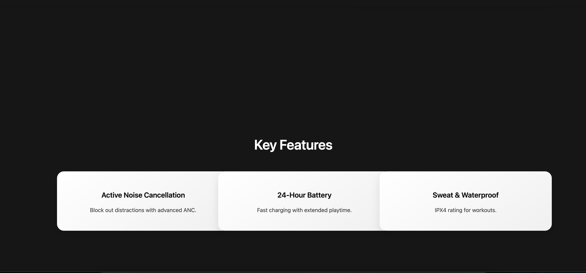

# OIBSIP_WebDevelopment_Task1: AirPods Landing Page - SoundWave Pro 🎧

## 🔍 Objective

To design and develop a **modern, responsive, and visually captivating landing page** for a premium wireless earbuds product called **SoundWave Pro**. The page mimics the sleek, aesthetic appeal of real-world tech brands like Apple, with interactive UI, product showcase, and specifications.

---

## 🚀 Features & Steps Performed

### 1. **Sticky Navigation Bar**
- Responsive and fixed top navigation with smooth scrolling to sections.

### 2. **Hero Section**
- Hero title, short description, and a call-to-action button (`Add to Cart - $199`).
- Clean, centered layout with modern typography and colors.

### 3. **Gallery Carousel**
- JavaScript-powered image slider for showcasing multiple product views.
- Previous/next buttons and dot navigation for a seamless user experience.

### 4. **Key Features Section**
- Highlighted features using grid layout with subtle hover effects:
  - Active Noise Cancellation
  - 24-Hour Battery
  - Sweat & Waterproof (IPX4)

### 5. **Image Gallery**
- Grid-based responsive gallery using actual product images.
- Image hover zoom and glow effect for a polished visual feel.

### 6. **Technical Specifications**
- Fully responsive grid with sections like:
  - Audio Technology
  - Battery Life
  - Connectivity (Bluetooth 5.3, H1 Chip)
  - Water Resistance
  - Compatibility (iOS, Android, Windows)

### 7. **Animations & Effects**
- AOS (Animate On Scroll) for smooth content reveal.
- GLightbox & Swiper.js integration planned.
- Glowing divider line between sections.
- Hover-based tilt effects and gallery transitions.

---

## 🛠️ Tools & Technologies Used

- **HTML5** – Structure and semantics  
- **CSS3** – Styling with responsive grids, hover effects, and gradients  
- **JavaScript (Vanilla)** – Carousel logic and interactive behavior  
- **External Libraries**:  
  - `Swiper.js` for carousel support  
  - `AOS` for scroll animations  
  - `GLightbox` for lightbox-ready gallery integration

---

## 🎯 Outcome

A complete, responsive, and immersive landing page simulating a real e-commerce product experience. The website is visually appealing, modern, and mobile-friendly, demonstrating practical knowledge of front-end web development.

---

## 📸 Screenshots
### Preview Section

### 🖥️ Hero Section

### 🖼️ Gallery

### ⚙️ Specs Section

